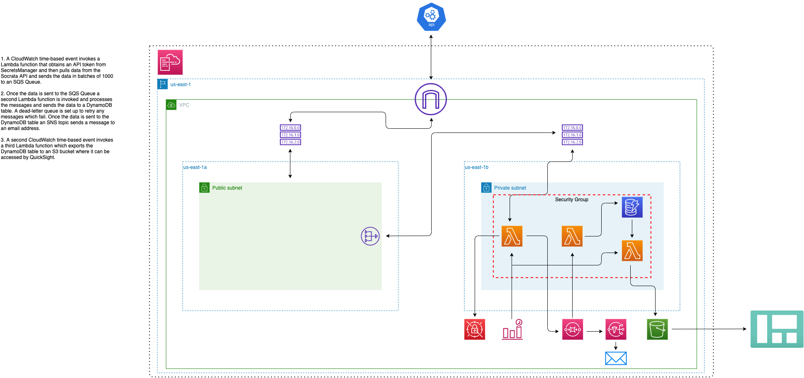

# SF-Greenhouse Gas Emissions DE Pipeline

Tracking greenhouse gas emissions in San Francisco across department, source type, consumption units, CO2 emissions, and fiscal year. Completly hosted in the AWS ecosystem including a dashboard built with Amazon Quicksight.

**If you would like to replicate this project deploy the CloudFormation templates in the cfn directory.**

## Architecture

Data is sourced from San Francisco's Open Data API (https://dev.socrata.com/foundry/data.sfgov.org/pxac-sadh) as JSON documents containing information on greenhouse gas emissions throughout San Francisco. A series of Lambda functions integrated with SQS orchestrate the data movement and transformation throughout the pipeline. The presentation layer is created using Amazon QuickSight.

## Infrastructure
The project is housed in the AWS ecosystem, packaged into two CloudFormation templates and utilizes the following resources:

**VPC:**
-   Custom built VPC with two subnets (1 private, 1 public)
-   IGW, NATGW and Route Tables
-   Security Groups

**DynamoDB:**

-   On-Demand Capacity
- Partition key on the uuid field

**3 Lambda Functions:**
-   1 for pulling data from the API and sending it in batches to an SQS Queue
-   1 for transforming the data from the SQS Queue and sending it to DynamoDB
-   1 for exporting the data to S3

**Secrets Manager:**
-   For storing connection variables and API tokens

**S3 Bucket with versioning enabled:**
-   For storing the transformed data in JSON format

**SQS with a deadletter queue:**
-   For receiving data in batches from the API
-   Deadletter queue for automatic retry of failed messages

**SNS**
-   For sending failure messages to a Slack Channel

**CloudWatch Time-Based Events:**
-   For invoking the first lambda function and triggering the pipeline

**Amazon Quicksight:**
-   For the visualization layer

## Dashboard

## Points moving forward

Just like my previous project I had a ton of fun working on this project. I received a lot of excellent feedback on my previous project and implemented some of the suggestions which I had received. Also, just like last time I have some things I would like to point out:

-   The biggest change from my last project to this one is the utilization of CloudFormation. This was probably the most suggested implementation from the previous project. I have to say, it was definitly a great idea, being able to spin up and spin down the entire infrastructure in a matter of minutes was amazing and saved me a ton of cost. When I was done working on the project for the day I could spin down the infrastructure and not have to worry about getting it to work the next time I wanted to work on it.

-   Another big change from the last project is the architecture diagram. The previous diagram was cluttered and could be difficult to follow. I tried my best to address those issues with a better looking diagram, utilizing space for the subnets and VPC allowed me to space things out a bit more and in turn made the diagram much easier to follow.

-   The biggest issue I faced during this project was getting the data from the SQS Queue. I thought that the data for the messages was in the location of event['Messages'][0]['body'] at first, but it is actually in event['Records'][0]['body']. The most confusing thing about this is if you print out the format of the message in your code editor the data will be in event['Messages'][0]['body'], but it is actually in event['Records'][0]['body']. This is also buried within the SQS documentation which was kind of frustrating.

-   I feel as if this project was less work because of the utilization of CloudFormation. It just made development so much easier.

-   I implemented unit tests again, but this time I did not write unit tests to check the connections. That was some more feedback which I had received.

-   I still utilized Amazon QuickSight for the Dashboard this time. I did want to go the Tableau route but I have not worked with JDBC drivers before and that is what I needed in order to connect Tableau to S3. That is something on my to-do list. I did not use Athena because that service is quite frustrating to use and I was not trying to use SQL to query the dataset.

-   Another suggestion from my last project was to only send error messages to the slack channel instead of sending all messages about data transformations and data pulls.

-   All in all it was another fun project and I learned a lot. I already have the next project planned out. It will consist of all the technologies which have been utilized in this project and my last one. There will also be some suggestions from the last project which I did not implement in this one. 
